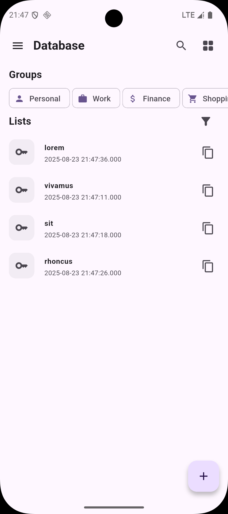
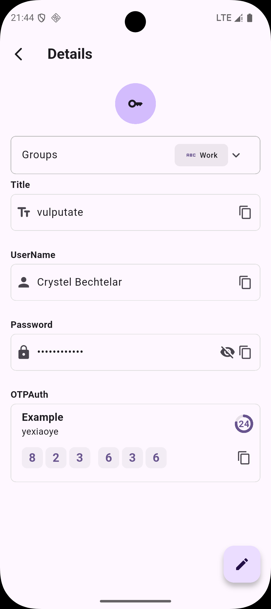
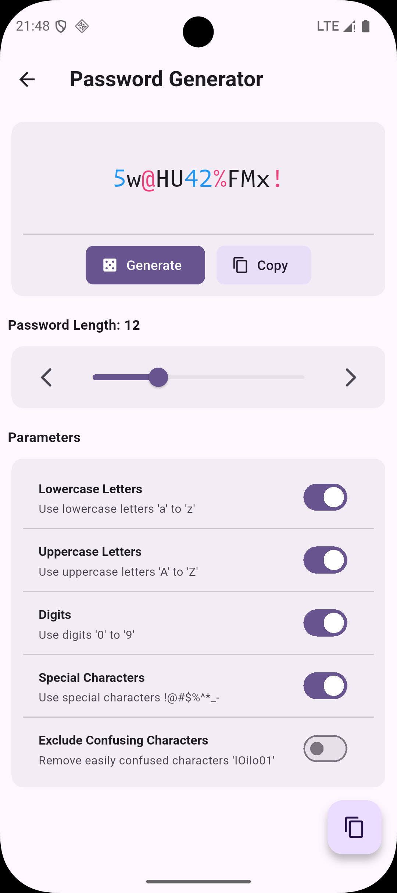
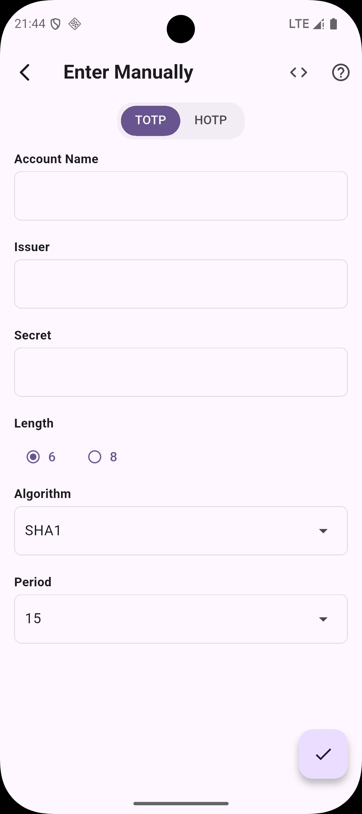
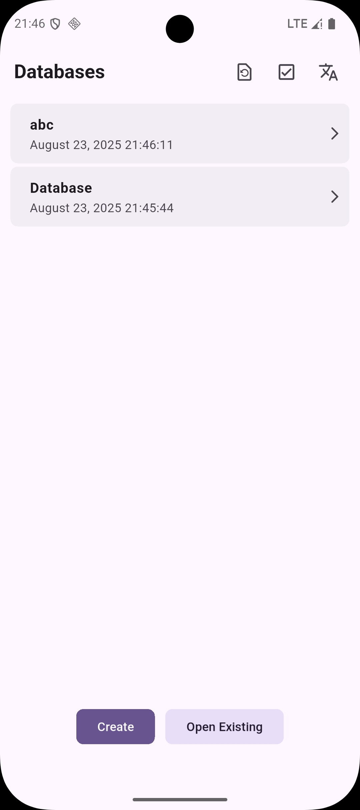
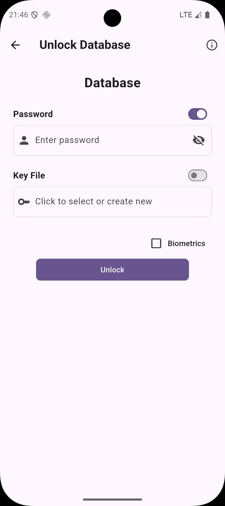
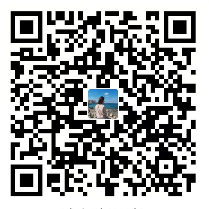

# 🏔️ Peak Pass

  
	
Peak Pass is a clean and secure password manager based on Keepass technology, supporting both TOTP and HOTP two-factor authentication.

  
<a href="./README.md">ENGLISH</a>&nbsp;|&nbsp;<a href="./README.zh-CN.md">中文</a>

> The safest way to manage passwords stems from users' security awareness and good habits

## 🌟 Features

- 🔒 **Secure and Reliable** - Based on proven Keepass technology
- 🕐 **Two-Factor Authentication Support** - Built-in TOTP and HOTP dynamic password functionality
- 📱 **Cross-Platform Support** - Coming soon to iOS, macOS, Windows, Linux
- 🎯 **Simple and Easy to Use** - Intuitive user interface for easy password management
- 🚀 **Open Source and Transparent** - Publicly auditable code to ensure security

## 📸 App Screenshots

<table>
  <tr>
    <td></td>
    <td></td>
    <td></td>
  </tr>

  <tr>
    <td></td>
    <td></td>
    <td></td>
  </tr>
</table>

## 🚀 Supported Platforms

| Platform | Status            |
|----------|-------------------|
| Android  | Beta              |
| iOS      | 🚧 In Development |
| macOS    | 🚧 In Development |
| Windows  | 🚧 In Development |
| Linux    | 🚧 In Development |

## 📦 Feature Highlights

### 🔐 Security Features
- Based on mature KeePass technology with over 15 years of security validation
- Uses AES-256 and ChaCha20 dual encryption algorithms, military-grade security standards
- Supports multiple key derivation functions including Argon2 and AES-KDF to resist brute force attacks
- No network connection required, offline storage ensures data privacy
- Two-factor authentication support (TOTP/HOTP)

### 🎨 User Experience
- Clean and intuitive interface design
- Biometric unlock support
- Fast password search
- Auto-fill functionality

## 🤝 Contributing

Feel free to submit Issues and Pull Requests to help us improve Peak Pass!

## ❤️ Donation Support

If you like Peak Pass and want to support continued development, please consider donating through the following methods:

<table>
  <tr>
    <td>
      

        
WeChat Pay

      
 
    </td>
    <td>
      

        
Alipay

      
 
    </td>
  </tr>
</table>

Your support is our motivation for continuous improvement!

## 📄 License

This project is licensed under the GPL-3.0 License - see the [LICENSE](./LICENSE.txt) file for details

## 🙏 Acknowledgements

- Thanks to the [kdbx](https://github.com/authpass/kdbx.dart) project for providing kdbx file format parsing support

---

🔒 Protecting Your Digital Life Security 🛡️
