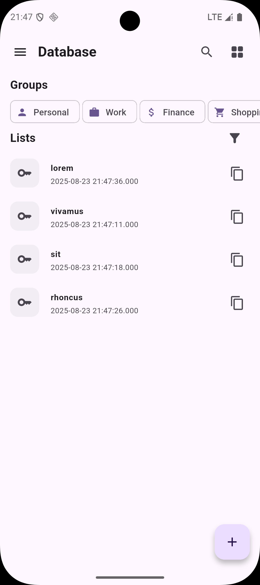
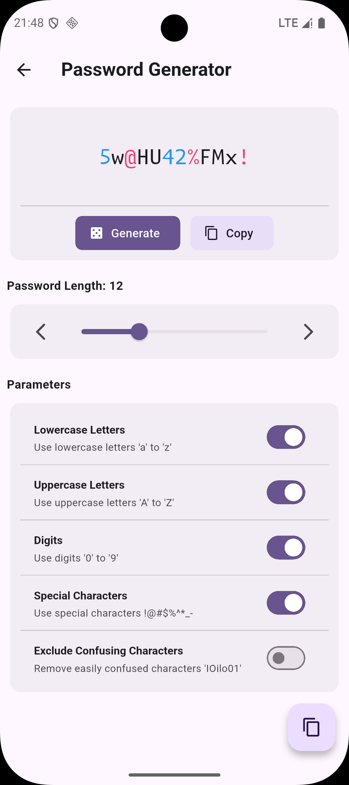
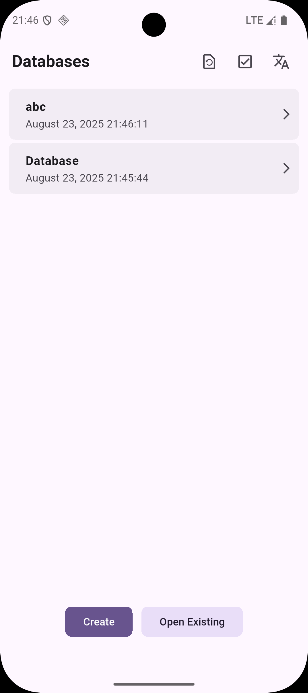
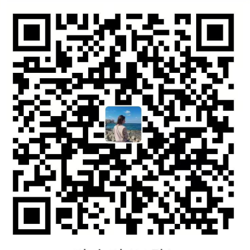

# 🏔️ Peak Pass

  
	
Peak Pass 是一款基于 Keepass 技术的简洁安全密码管理器，支持 TOTP 和 HOTP 双重认证功能。

  
<a href="./README.md">ENGLISH</a>&nbsp;|&nbsp;<a href="./README.zh-CN.md">中文</a>

> 最安全的密码管理方式，源于使用者的安全意识与良好习惯

## 🌟 特性

- 🔒 **安全可靠** - 基于久经考验的 Keepass 技术
- 🕐 **双重认证支持** - 内置 TOTP 和 HOTP 动态密码功能
- 📱 **跨平台支持** - 即将支持 iOS、macOS、Windows、Linux
- 🎯 **简洁易用** - 直观的用户界面，轻松管理密码
- 🚀 **开源透明** - 代码公开可审查，确保安全性

## 📸 应用截图

<table>
  <tr>
    <td></td>
    <td></td>
    <td></td>
  </tr>

  <tr>
    <td></td>
    <td></td>
    <td></td>
  </tr>
</table>

## 🚀 支持的平台

| 平台    | 状态      |
| ------- | --------- |
| Android | Bete 版   |
| iOS     | 🚧 开发中 |
| macOS   | 🚧 开发中 |
| Windows | 🚧 开发中 |
| Linux   | 🚧 开发中 |

## 📦 功能亮点

### 🔐 安全特性

- 基于 KeePass 成熟技术，经过 15 年以上的安全验证
- 采用 AES-256 和 ChaCha20 双重加密算法，军用级安全标准
- 支持 Argon2、AES-KDF 等多种密钥派生函数，抵御暴力破解
- 无需网络连接，离线存储确保数据隐私
- 双重认证支持 (TOTP/HOTP)

### 🎨 用户体验

- 简洁直观的界面设计
- 支持生物识别解锁
- 快速密码检索
- 自动填充功能

## 🤝 贡献

欢迎提交 Issue 和 Pull Request 来帮助我们改进 Peak Pass！

## ❤️ 捐助支持

如果您喜欢 Peak Pass 并希望支持项目的持续开发，欢迎通过以下方式捐助我们：

<table>
  <tr>
    <td>
      

        
微信支付

      
 
    </td>
    <td>
      

        
支付宝支付

      
 
    </td>
  </tr>
</table>

您的支持是我们持续改进的动力！

## 📄 许可证

本项目采用 GPL-3.0 许可证 - 详见 [LICENSE](./LICENSE.txt) 文件了解详情

## 🙏 致谢

- 感谢 [kdbx](https://github.com/authpass/kdbx.dart) 项目提供的 kdbx 文件格式解析支持

---

🔒 保护您的数字生活安全 🛡️

